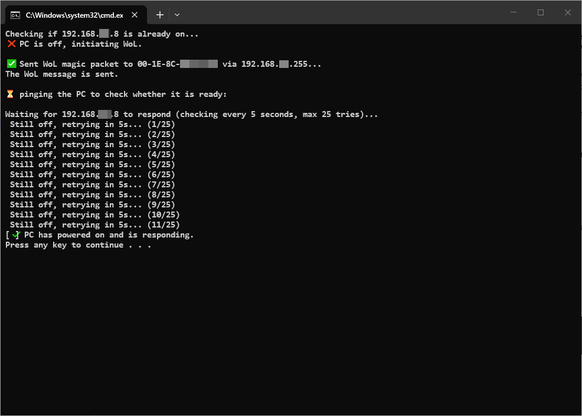

## Wake-on-LAN Script

A simple Windows batch script for remotely powering on a PC using Wake-on-LAN (WoL).

The script checks whether the target PC is already online. If it is offline, it sends a Wake-on-LAN Magic Packet to the specified MAC address and then monitors the PC until it comes online.

### Configuration

Open the `.bat` file with a text editor and configure these three values:

    set PC_IP=192.168.1.XX
    set BROADCAST_IP=192.168.XX.255
    set MAC=AA-BB-CC-00-11-22

Replace them with the target PC's IP address, your network's broadcast address, and the target network adapter's MAC address.

### Usage

After configuration, simply run the `.bat` file. No administrator privileges are required.

The script:
1. Checks whether the target PC is already online.
2. Sends a Wake-on-LAN Magic Packet if the PC is offline.
3. Checks the PC's status every five seconds for approximately two minutes.
4. Produces a notification beep when the PC responds.
 

> Wake-on-LAN must be enabled and supported by the target computer's motherboard, network adapter, and operating system configuration.

 

